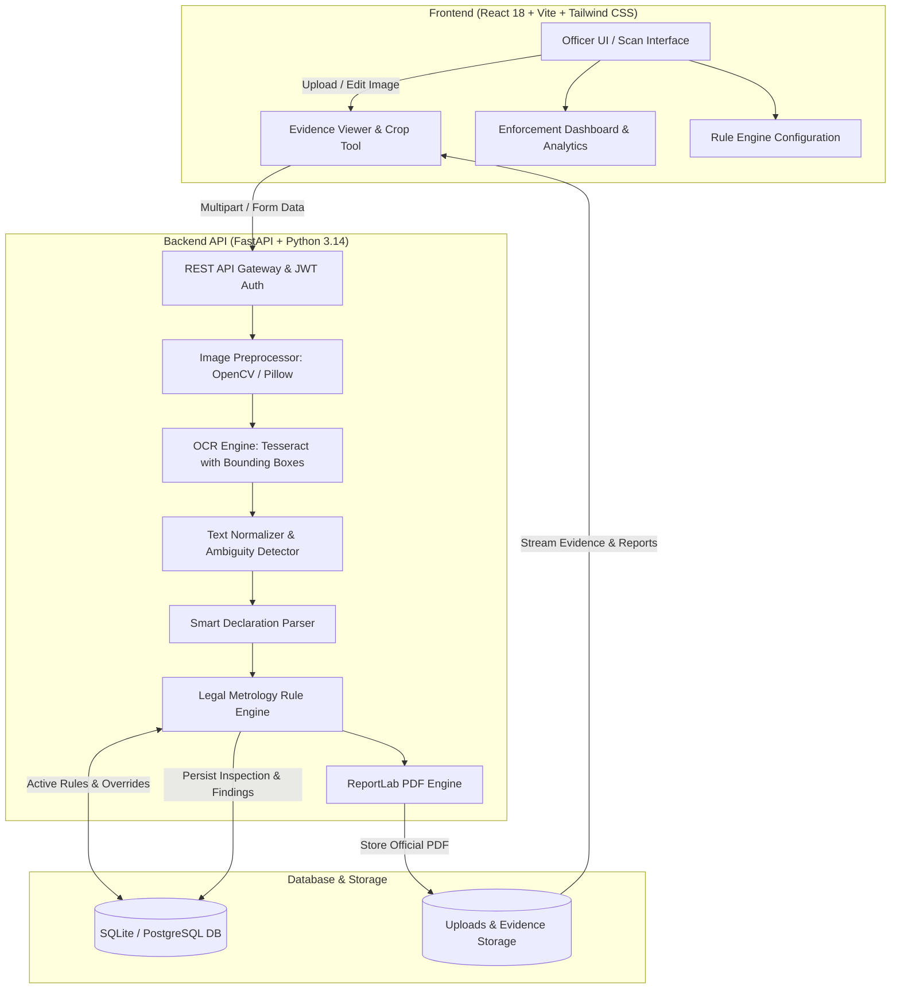

# VeriPack — Legal Metrology Packaged Commodities Compliance Inspector

**Smart India Hackathon (SIH) 2026 • Problem Statement ID:** 26034  
**Title:** Software System to check compliance of Packaged Commodities under Legal Metrology (Packaged Commodities) Rules, 2011 by scanning products, images and labels.  
**Organization:** Ministry of Consumer Affairs, Food & Public Distribution  
**Department:** Department of Consumer Affairs (DoCA), Government of India  
**Statutory Foundation:** Legal Metrology Act, 2009 & Legal Metrology (Packaged Commodities) Rules, 2011 (with Amendments)

---

## 1. Executive Summary & Objective

**VeriPack** is an AI-assisted statutory enforcement decision-support platform designed for Legal Metrology officers and inspectors. Rather than merely outputting raw OCR text, VeriPack implements an end-to-end statutory compliance pipeline:

1. **Multi-Panel Image Capture & Preprocessing:** Upload front label, back panel, side panels, or e-commerce listing screenshots with built-in orientation adjustment and OpenCV CLAHE contrast enhancement.
2. **Text & Label Localization:** Localizes word-level and line-level bounding boxes with confidence scoring via Tesseract OCR v5.5.
3. **Smart Declaration Extraction:** Parses verbatim packaging text into structured statutory entities using custom regular expressions and NLP heuristic patterns with OCR error tolerance (e.g. handling `%` for `₹`, `Rs.`, etc.).
4. **Ambiguity & OCR Error Detection:** Detects suspicious or ambiguous representations (e.g., flagging `"500 9"` as potentially representing `"500 g"` with `REVIEW REQUIRED`).
5. **Configurable Statutory Rule Engine:** Evaluates declarations against active Legal Metrology rules stored in the database, supporting category-specific overrides (Food & Beverages, Cosmetics, Electronics, General).
6. **Interactive Visual Evidence Canvas:** Synchronizes rule findings directly with colored packaging bounding box overlays (Green = Pass, Amber = Warning/Review, Red = Violation/Fail), complete with zoom, pan, and interactive hover inspection.
7. **Official PDF Inspection Report Generation:** Generates tamper-evident, official DoCA compliance reports with Ashok emblem branding, audit tables, embedded packaging photos, officer signatures, and statutory notices.
8. **Role-Based Access Control (RBAC):** Segregates capabilities between `SUPER_ADMIN` (Enforcement Director), `INSPECTOR` (Field Enforcement Officer), and `VIEWER` (Consumer Dispute Auditor).

---

## 2. System Architecture



---

## 3. Statutory Legal Metrology (PC) Rules, 2011 Framework

| Rule Code | Statutory Rule | Legal Metrology Citation | Verification Logic |
| :--- | :--- | :--- | :--- |
| **LM-RULE-6-1-A** | Manufacturer Name & Address | Rule 6(1)(a) | Mandatory complete address with 6-digit Postal Index Number (PIN Code). |
| **LM-RULE-6-1-B** | Generic Commodity Name | Rule 6(1)(b) | Verifies common or generic name of commodity. |
| **LM-RULE-6-1-C** | Net Quantity & Metric Units | Rule 6(1)(c), Rule 11, Rule 12 | Second Schedule standard units (`g`, `kg`, `ml`, `l`, `N`, `U`). Flags colloquial `gms`/`kgs` or ambiguous `500 9`. |
| **LM-RULE-6-1-D** | Month & Year of Mfg/Packing | Rule 6(1)(d) | Identifies MFD, MFG, PKD, or Import date in MM/YYYY or Month YYYY format. |
| **LM-RULE-6-1-E** | Maximum Retail Price (MRP) | Rule 6(1)(e) | Validates price and mandatory statutory phrase *"inclusive of all taxes"*. |
| **LM-RULE-6-1-N** | Consumer Care Grievance Redressal | Rule 6(1)(n) | Both helpline telephone/toll-free AND email address are mandatory. |
| **LM-RULE-6-10** | Country of Origin | Rule 6(10) | Mandatory declaration of country of origin for all imported commodities. |
| **LM-RULE-7** | Legibility & Minimum Font Size | Rule 7, Table-I | Preliminary visual assessment of character height relative to net quantity. |

---

## 4. 5 Realistic Pre-Loaded Demo Scenarios

VeriPack comes pre-seeded with 5 realistic synthetic packaged label images generated via Pillow for instant evaluation:

1. **Tata Pure Refined Iodised Salt (`compliant_salt`):**  
   *Status: COMPLIANT (100% Score)* — All mandatory declarations present, standard unit (`1 kg`), valid MRP with taxes, complete address with PIN `361345`, consumer helpline and email.
2. **Royal Crunch Butter Cookies (`missing_mrp_snack`):**  
   *Status: NON-COMPLIANT (Violations)* — Missing Maximum Retail Price (Rule 6(1)(e)) and missing consumer care email (Rule 6(1)(n)).
3. **Natural Energy Protein Mix (`ambiguous_qty`):**  
   *Status: REVIEW REQUIRED (Warning)* — Simulates classic OCR misrecognition of `"500 9"` for `"500 g"`, preventing silent false passes.
4. **Aero Wireless Buds (`imported_earbuds`):**  
   *Status: NON-COMPLIANT (Import Violations)* — Imported electronic product missing Country of Origin (Rule 6(10)) and Importer name/address (Rule 6(1)(a)).
5. **Spice Delight Garam Masala (`warnings_spice`):**  
   *Status: REVIEW REQUIRED (Warnings)* — Non-standard unit symbol `"gms"` (Rule 12) and MRP lacking explicit *"inclusive of all taxes"* wording.

---

## 5. Quick Start Guide (Run Locally)

### Prerequisites
- **Python 3.10+** (Tested on Python 3.14)
- **Node.js v18+** (Tested on Node v24)
- **Tesseract OCR** installed (Windows default: `C:\Program Files\Tesseract-OCR\tesseract.exe`)

---

### Step 1: Clone or Navigate to Directory
```powershell
cd C:\Users\babua\.gemini\antigravity\scratch\veripack
```

---

### Step 2: Set Up & Run Backend
```powershell
cd backend
python -m pip install -r requirements.txt
python -m app.seed
python -m uvicorn app.main:app --host 127.0.0.1 --port 8000 --reload
```
*Backend API will be running at:* `http://localhost:8000`  
*Swagger API Documentation:* `http://localhost:8000/docs`

---

### Step 3: Set Up & Run Frontend
In a new terminal:
```powershell
cd C:\Users\babua\.gemini\antigravity\scratch\veripack\frontend
npm install
npm run dev
```
*Frontend will be running at:* `http://localhost:5173`

---

## 6. Default Demo Credentials

| Role | Name | Email | Password | Privileges |
| :--- | :--- | :--- | :--- | :--- |
| **INSPECTOR** | Rajesh Sharma | `inspector.sharma@doca.gov.in` | `Inspector@2026` | Upload, scan, rotate, inspect, remarks, download PDF |
| **SUPER_ADMIN** | Dr. A. K. Verma | `admin@doca.gov.in` | `Admin@DocA2026` | Full rule engine toggle, user provisioning, all inspections |
| **VIEWER** | Pooja Mehta | `viewer@consumeraffairs.nic.in` | `Viewer@2026` | Read-only audit history, product repository, PDF download |

*(Note: The login screen contains 1-click evaluation buttons to automatically populate these credentials).*

---

## 7. Running Automated Tests

Run the complete pytest test suite:
```powershell
cd C:\Users\babua\.gemini\antigravity\scratch\veripack\backend
python -m pytest tests -v
```

**Test Coverage (14 Tests Passed):**
- `test_root_health`: System operational status
- `test_auth_login`: JWT generation and role validation
- `test_dashboard_stats_and_rules`: Analytics aggregation
- `test_scan_demo_scenario`: End-to-end OCR and rule evaluation
- `test_password_hashing`: Bcrypt hash security
- `test_jwt_token`: Token encoding and signature verification
- `test_detect_quantity_ambiguity`: "500 9" and "gms" detection
- `test_normalize_quantity`: Metric unit normalization
- `test_declaration_parser_mrp_detection`: Retail price & tax inclusion
- `test_declaration_parser_consumer_care`: Helpline phone & email extraction
- `test_pdf_report_generation`: ReportLab official DoCA PDF output
- `test_compliant_evaluation`: Pass status on all rules
- `test_missing_mrp_evaluation`: Violation detection
- `test_imported_missing_origin_evaluation`: Rule 6(10) import violation

---

## 8. REST API Documentation

| Method | Endpoint | Description | Auth Required |
| :--- | :--- | :--- | :--- |
| `POST` | `/api/auth/login` | Officer authentication & JWT issuance | No |
| `GET` | `/api/auth/me` | Current authenticated officer profile | Yes |
| `POST` | `/api/scans/analyze` | Execute OCR & Legal Metrology rule audit | Yes |
| `GET` | `/api/scans` | List historical inspections with filters | Yes |
| `GET` | `/api/scans/{id}` | Detailed inspection findings & bounding boxes | Yes |
| `PATCH` | `/api/scans/{id}/remarks` | Update inspector enforcement remarks | Yes |
| `GET` | `/api/dashboard/stats` | KPI stats, compliance distribution, charts | Yes |
| `GET` | `/api/products` | Master catalog of scanned commodities | Yes |
| `GET` | `/api/reports/{id}/pdf` | Generate & download official DoCA inspection PDF | Yes |
| `GET` | `/api/rules` | List configurable compliance rules | Yes |
| `PATCH` | `/api/rules/{id}/toggle` | Enable / disable statutory rule | Super Admin |
| `POST` | `/api/rules` | Add custom category rule for amendments | Super Admin |
| `GET` | `/api/users` | List enforcement personnel | Super Admin |
| `POST` | `/api/users` | Provision new inspector account | Super Admin |

---

## 9. Statutory Legal Disclaimer

> **IMPORTANT:** VeriPack is an AI-assisted enforcement decision-support system. In accordance with the Legal Metrology Act, 2009, this system generates preliminary technical assessments. Any penal notice, compounding, or prosecution under Section 36 must be preceded by physical verification by an authorized Legal Metrology Officer.
